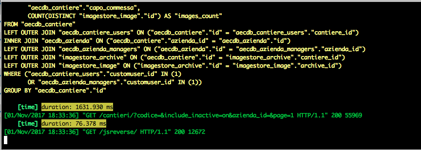

=============================
django-query-tracer
=============================

.. image:: https://badge.fury.io/py/django-query-tracer.svg
    :target: https://badge.fury.io/py/django-query-tracer

.. image:: https://travis-ci.org/morlandi/django-query-tracer.svg?branch=master
    :target: https://travis-ci.org/morlandi/django-query-tracer

.. image:: https://codecov.io/gh/morlandi/django-query-tracer/branch/master/graph/badge.svg
    :target: https://codecov.io/gh/morlandi/django-query-tracer

A simplified version of django-devserver limited to SQL tracing and Ajax dump.

Motivations
-----------

django-devserver is a very nice and usefull package, but the project isn't very active,
and occasional problems related to new Django versions stay unfixed for long time even
when a solution is available as PR.

Being mostly interested in tracing db queries, I finally decided to package a
stripped down version of the project.

Screenshots
-----------

Quickstart
----------

Install django-query-tracer::

    pip install django-query-tracer

Add it to your `INSTALLED_APPS`:

.. code-block:: python

    INSTALLED_APPS = (
        ...
        'query_tracer',
        ...
    )

Add django-query-tracer's middleware:

.. code-block:: python

    MIDDLEWARE_CLASSES = [
        ...
        'query_tracer.middleware.QueryTracerMiddleware',
        ...
    ]

Settings
--------

QUERYTRACER_MODULES

    Selects active modules.

    Default: []

    Example::

        QUERYTRACER_MODULES = [
            'query_tracer.modules.sql.SQLRealTimeModule',
            'query_tracer.modules.sql.SQLSummaryModule',
            'query_tracer.modules.ajax.AjaxDumpModule',
            'query_tracer.modules.time.TimeModule',
        ]

QUERYTRACER_FILTER_OUT_SQL

    A list of regex patterns to filter out SQL queries.

    Queries matching any of the given patterns will be excluded from log.

    Example::

        QUERYTRACER_FILTER_OUT_SQL [
            re.compile('djkombu_\w+'),  # Filter all queries related to Celery
        ]

QUERYTRACER_FILTER_IN_SQL

    A list of regex patterns to filter in SQL queries.

    Only queries matching all patterns will be included in the log.

    Example::

        QUERYTRACER_FILTER_IN_SQL = [
            re.compile('sync_logs'),
            re.compile('date_created'),
        ]

DEVSERVER_TRUNCATE_SQL

    Disable SQL query truncation (used in SQLRealTimeModule) setting this to False

QUERYTRACER_AJAX_CONTENT_LENGTH

    Ajax responses longer than this will not be logged.

    Default: 300

QUERYTRACER_AJAX_PRETTY_PRINT

    If set, try to format ajax requests and responses as intented JSON

QUERYTRACER_SQL_MIN_DURATION

    Minimum time a query must execute to be shown, value is in MS

    Default: None

Sample local setup for development
----------------------------------

.. code-block:: python

    # Install query_tracer

    INSTALLED_APPS.append('query_tracer')

    MIDDLEWARE_CLASSES += [
        'query_tracer.middleware.QueryTracerMiddleware',
    ]

    QUERYTRACER_MODULES = (
        'query_tracer.modules.sql.SQLRealTimeModule',
        'query_tracer.modules.sql.SQLSummaryModule',
        'query_tracer.modules.ajax.AjaxDumpModule',
        'query_tracer.modules.time.TimeModule',
    )

    #QUERYTRACER_AJAX_CONTENT_LENGTH = 10000
    QUERYTRACER_AJAX_PRETTY_PRINT = True
    QUERYTRACER_TRUNCATE_SQL = False

    QUERYTRACER_FILTER_IN_SQL = [
        re.compile('sync_logs'),
        re.compile('date_created'),
    ]

Features
--------

See file "query_tracer/settings.py" for available options, and refer to
`django-devserver doc <https://github.com/dcramer/django-devserver>`_ for usage/

Time module
-----------

A simple **TimeModule** module has been added to display the time required to
process each Django view.

Utility functions
-----------------

query_traces.utils.trace.trace
    Prints a text message or list, optionally prettified

query_traces.utils.trace.prettyprint_query
    Format and print a generic SQL query

query_traces.utils.trace.prettyprint_queryset
    Format and print a queryset's query

query_traces.utils.trace.trace_func
    Prints function calls, showing actual parameters;
    to be used as decorator

query_traces.utils.time.ms_from_timedelta
    Returns timedelta in milliseconds

Credits
-------

This project is a stripped down version of:

*  `django-devserver <https://github.com/dcramer/django-devserver>`_

Tools used in rendering this package:

*  Cookiecutter_
*  `cookiecutter-djangopackage`_

.. _Cookiecutter: https://github.com/audreyr/cookiecutter
.. _`cookiecutter-djangopackage`: https://github.com/pydanny/cookiecutter-djangopackage
